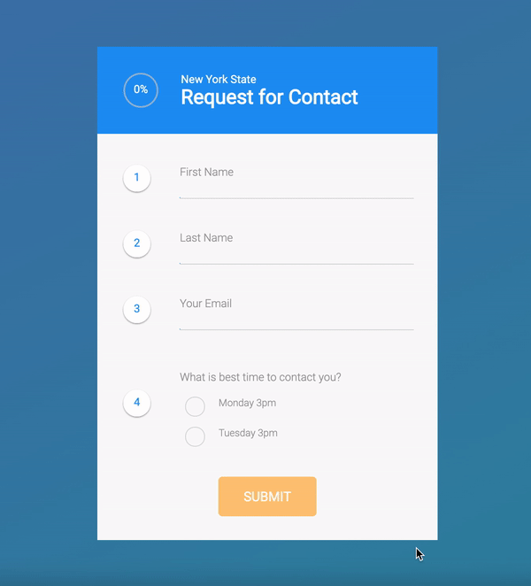

This project is based on [Leo Zakour](https://dribbble.com/leozakour) design of form flow - https://dribbble.com/shots/2371603-Form-Flow

## Contact Form

- Written in React (incl. React hooks)
- Includes animations made on SVG elements (e.g. progress circle with percentages)
- Animations are implemented using pure CSS (no external libraries)
- On submit data is stored in Firebase
